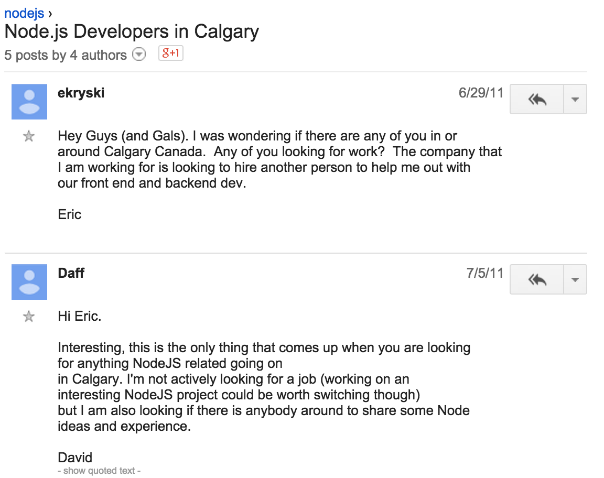
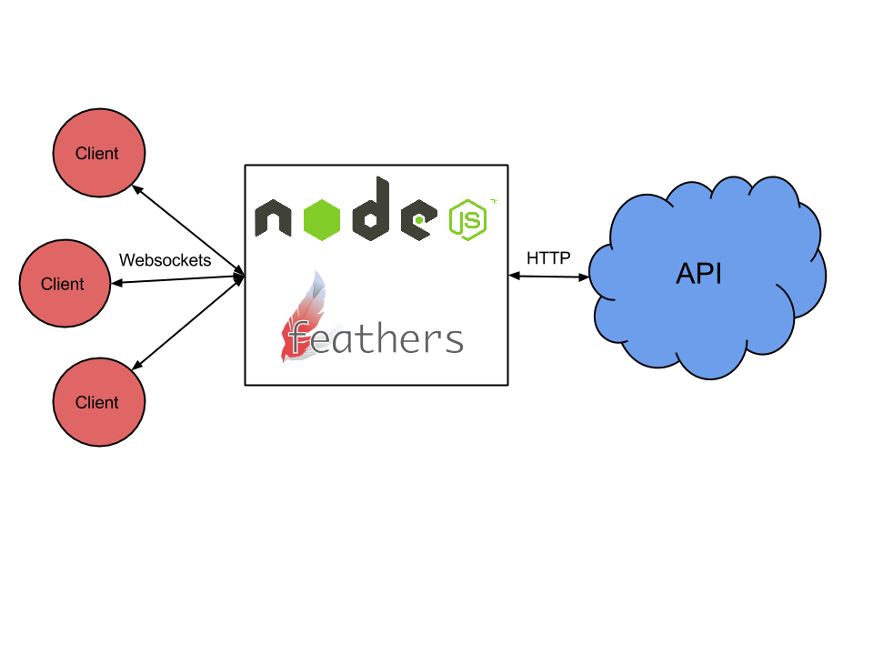

title: Better APIs and smarter AIs
output: index.html
theme: theme
controls: false
logo: theme/logo.png

--

# Better APIs and smarter AIs

## YYCJS summer finale

-- sponsors

# Our Sponsors


--

## How it all [began](https://groups.google.com/forum/#!topic/nodejs/E-uRuZfyo98)...



--

## This year

* [9 years of JavaScript](http://www.meetup.com/yyc-js/events/222682792/)
* [React in the real world](http://www.meetup.com/yyc-js/events/221664814/)
* [Modular JavaScript & ArangoDB](http://www.meetup.com/yyc-js/events/221663824/)
* [Ruby vs. JS - Building an API and making it real-time](http://www.meetup.com/yyc-js/events/221583296/)
* [The perfect JavaScript project](http://www.meetup.com/yyc-js/events/220713495/)
* [Learning JavaScript](http://www.meetup.com/yyc-js/events/220256403/)
* [HTML500](http://www.meetup.com/yyc-js/events/220071200/)
* [Back to the future](http://www.meetup.com/yyc-js/events/219630216/)

--

# Brought to you by

-- presenter


## Cory Smith

* [<i class="fa fa-github"></i> corymsmith](https://github.com/corymsmith)
* [<i class="fa fa-twitter"></i> @smixx](http://twitter.com/smixx)

-- presenter


## Eric Kryski

* [<i class="fa fa-github"></i> ekryski](https://github.com/ekryski)
* [<i class="fa fa-twitter"></i> @ekryski](http://twitter.com/ekryski)
* [<i class="fa fa-home"></i> erickryski.com](http://erickryski.com)

-- presenter


## David Luecke

* [<i class="fa fa-github"></i> daffl](https://github.com/daffl)
* [<i class="fa fa-twitter"></i> @daffl](http://twitter.com/daffl)

-- presenter


## SAM

* [<i class="fa fa-github"></i> daffl/samjs.ai](https://github.com/daffl/samjs.ai)

-- centered

### Built with...

## [](http://feathersjs.com)

## [BrainJS](https://github.com/harthur/brain)

## [node-natural](https://github.com/NaturalNode/natural)

--

## Express

```javascript
// npm install express body-parser
var express = require('express');
var bodyParser = require('body-parser');

var app = express()
  .use(bodyParser.json())
  .use('/', express.static(__dirname))
  .post('/todos', function(req, res, next) {
    var todo = req.body;
    res.json(todo);
  });

app.listen(8080);
```

--

## Feathers Services

```javascript
var feathers = require('feathers');
var bodyParser = require('body-parser');

var app = feathers()
  .use(bodyParser.json())
  .use('/', feathers.static(__dirname))
  .configure(feathers.rest())
  .configure(feathers.socketio())
  .use('/todos', {
    find: function(params, callback) {},
    get: function(id, params, callback) {},
    create: function(data, params, callback) {},
    update: function(id, data, params, callback) {},
    patch: function(id, data, params, callback) {},
    remove: function(id, params, callback) {}
  });

app.listen(8080);
```

--

## A MongoDB REST and real-time API

10 lines, no generators, no magic

```javascript
// npm install feathers feathers-mongodb body-parser
var feathers = require('feathers');
var bodyParser = require('body-parser');
var mongodb = require('feathers-mongodb');

var app = feathers()
  .configure(feathers.rest())
  .configure(feathers.socketio())
  .use(bodyParser.json())
  .use(feathers.static(__dirname))
  .use('/todos', mongodb({
    collection: 'todos'
  }));

app.listen(8080);

app.service('todos').create({
  text: 'A Todo created on the server'
  complete: false
});
```

--

## Client use

[feathers-client](https://github.com/feathersjs/feathers-client) is a JavaScript client that connects to REST or real-time Feathers services. Use it on other NodeJS servers, with libraries like [jQuery](http://feathersjs.github.io/todomvc/feathers/jquery/#/all) or client side frameworks like React, Angular or CanJS:

```javascript
<script src="https://code.jquery.com/jquery-2.1.4.js"></script>
<script src="socket.io/socket.io.js"></script>
<script src="node_modules/feathers-client/dist/feathers.js"></script>
<script type="text/javascript">
  var socket = io();
  var app = feathers().configure(feathers.socketio(socket));
  var todos = app.service('todos');

  todos.on('created', function(todo) {
    console.log('New Todo created: ' + todo.text);
  });

  todos.create({
    text: 'Todo created on the client',
    complete: false
  });
</script>
```

-- centered

## Real-time proxy for existing APIs



--

# Demo: React real-time Todos

--

# Demo: Android and iOS real-time Todos

--

# Demo: A voice controlled shopping list

--

# Programming the future

-- centered


--

## COBOL (1959)

```
DISPLAY "Enter First Number      : " WITH NO ADVANCING
ACCEPT Num1
DISPLAY "Enter Second Number     : " WITH NO ADVANCING
ACCEPT Num2
DISPLAY "Enter operator (+ or *) : " WITH NO ADVANCING
ACCEPT Operator
IF Operator = "+" THEN
  ADD Num1, Num2 GIVING Result
END-IF
IF Operator = "*" THEN
  MULTIPLY Num1 BY Num2 GIVING Result
END-IF
DISPLAY "Result is = ", Result
```

--

## JavaScript/ES6 (2015)

```javascript
import readline from 'readline';

const rl = readline.createInterface({
  input: process.stdin, output: process.stdout
});

rl.question("Enter First Number", num1 => {
  num1 = parseInt(num1, 10);
  rl.question("Enter Second Number", num2 => {
    num2 = parseInt(num2, 10);
    rl.question("Enter Operator (+ or *)", operator => {
      let result = -1;

      if(operator === '*') {
        result = num1 * num2;
      } else if(operator === '+') {
        result = num1 + num2;
      }

      console.log('Result is = ' + result);
      rl.close();
    });
  });
});
```

--

# More teaching. Less coding.
